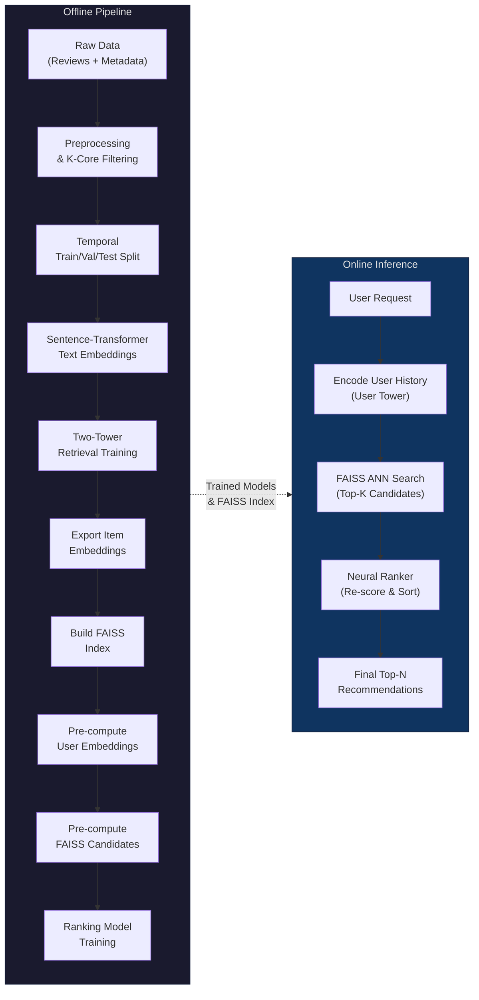
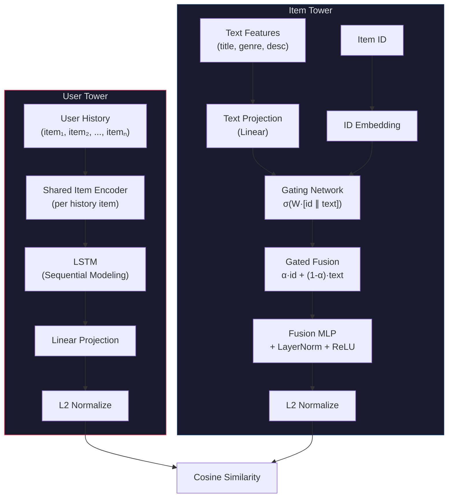
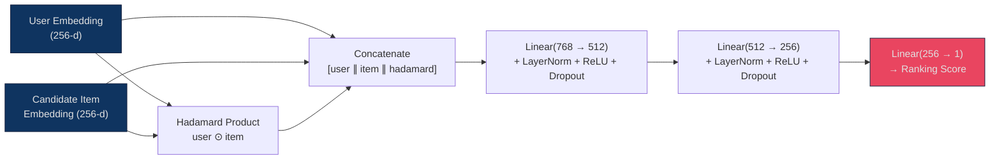
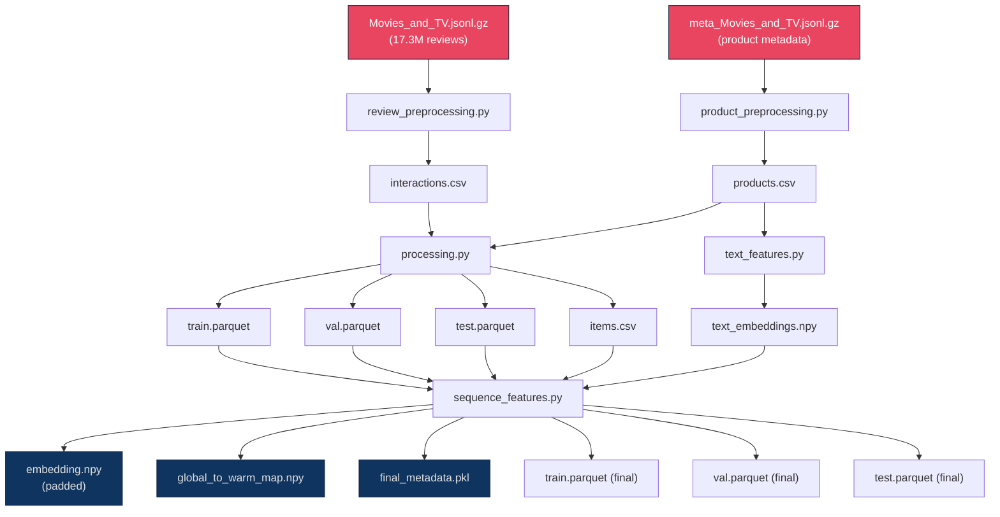

<p align="center">
  <h1 align="center">Two-Stage Neural Recommendation System</h1>
  <p align="center">
    <em>Industrial-grade Retrieval & Ranking pipeline for the Amazon Products Dataset (Movies & TV Category)</em>
  </p>
  <p align="center">
    <a href="#architecture"></a>
    <a href="#tech-stack"></a>
    <a href="#inference-api"></a>
    <a href="#docker"></a>
    <a href="LICENSE"></a>
  </p>
</p>

---

## Table of Contents

- [Overview](#overview)
- [Architecture](#architecture)
  - [System Pipeline](#system-pipeline)
  - [Stage 1 — Retrieval (Two-Tower Model)](#stage-1--retrieval-two-tower-model)
  - [Stage 2 — Ranking (Neural Ranker)](#stage-2--ranking-neural-ranker)
- [Hybrid Cold-Start Handling](#hybrid-cold-start-handling)
- [Dataset](#dataset)
- [Data Processing Pipeline](#data-processing-pipeline)
  - [Review Preprocessing](#1-review-preprocessing)
  - [Product Preprocessing](#2-product-preprocessing)
  - [Data Splitting & Feature Engineering](#3-data-splitting--feature-engineering)
  - [Text Embedding Generation](#4-text-embedding-generation)
  - [Sequence Feature Construction](#5-sequence-feature-construction)
- [Model Architecture Details](#model-architecture-details)
  - [Item Tower](#item-tower)
  - [User Tower](#user-tower)
  - [Loss Function](#loss-function)
  - [Ranking Model](#ranking-model)
- [Training](#training)
- [Results](#results)
  - [Retrieval Metrics](#retrieval-metrics-test-set)
  - [Ranking Metrics](#ranking-metrics-test-set)
  - [API Performance](#api-performance)
- [Hardware Limitations & Future Work](#hardware-limitations--future-work)
- [Inference API](#inference-api)
- [Docker](#docker)
- [Project Structure](#project-structure)
- [Tech Stack](#tech-stack)
- [Getting Started](#getting-started)
- [License](#license)
- [Citation](#citation)

---

## Overview

This project implements a **production-grade, two-stage recommendation system** that mirrors the architecture used by companies like YouTube, Pinterest, and Spotify. It operates on the [Amazon Reviews 2023](https://amazon-reviews-2023.github.io/) dataset (Movies & TV category) on a catalog of **434,000+ items** and **102,000+ users**, and consists of:

1. **Retrieval Stage** — A Two-Tower architecture that learns user and item embeddings in a shared latent space, enabling fast approximate nearest neighbor (ANN) candidate generation via FAISS.
2. **Ranking Stage** — A cross-interaction MLP that re-scores the retrieved candidates with richer feature interactions to produce the final ordered recommendations.

The system is a **hybrid recommender** that fuses collaborative filtering signals (learned ID embeddings capturing user-item interaction patterns) with content-based signals (semantic text embeddings from a pretrained sentence transformer). A learned gating network dynamically balances these two signals per item, making the system robust to both warm and **cold-start items** — a critical challenge in this dataset where a significant portion of items have limited interaction history.

The system is fully containerized with Docker (available on [Docker Hub](https://hub.docker.com/r/abdullahrashid/recsys-api)) and exposes a FastAPI inference endpoint that serves real-time recommendations with a **median latency of ~75ms**.

---

## Architecture

### System Pipeline



### Stage 1 — Retrieval (Two-Tower Model)

The retrieval model encodes users and items into a shared 256-dimensional embedding space. At serving time, FAISS performs an approximate nearest neighbor search over precomputed item embeddings to retrieve the top-K most relevant candidates.



### Stage 2 — Ranking (Neural Ranker)

The ranking model takes the user embedding and each candidate item embedding from the retrieval stage and predicts a relevance score using rich cross-feature interactions.



---

## Hybrid Cold-Start Handling

One of the hardest challenges in this project is the **cold-start problem**. The Amazon Movies & TV catalog contains 434,000+ products **(after filtering)**, but a large fraction of items were never seen during training. Traditional collaborative filtering approaches would completely fail on these items.

This system addresses cold-start through a **hybrid architecture** that combines two complementary signals:

| Signal | Type | Strength | Weakness |
|---|---|---|---|
| **ID Embeddings** | Collaborative Filtering | Captures complex user-item co-occurrence patterns | Zero signal for unseen items |
| **Text Embeddings** | Content-Based Filtering | Works for any item with a title/description | Cannot capture collaborative patterns |

**How the system handles cold items:**

1. **Gated Fusion** — The item tower's gating network learns to dynamically weight ID vs. text signals. For warm items with rich interaction history, the gate can lean on the ID embedding. For cold items, the gate relies entirely on the text embedding.
2. **ID Dropout (p=0.4)** — During training, 40% of item IDs are randomly replaced with the cold-start index, forcing the model to learn strong text-based representations. This acts as a regularizer and ensures the text pathway is always meaningful.
3. **Frozen Cold-Start Embedding** — Index 1 in the ID embedding table is permanently frozen at zero with its gradient zeroed, ensuring no signal leaks from the ID channel for cold items.
4. **Semantic Text Backbone** — The `all-mpnet-base-v2` sentence transformer produces rich 768-d embeddings from item metadata (title, genre, description, cast, director, etc.), providing a strong content-based signal regardless of interaction history.

This hybrid approach is what makes the system practical for real-world deployment, where new items are constantly being added to the catalog.

### Cold User Handling

While the hybrid architecture solves the **cold-item** problem, the system also needs to handle **cold users**, new users with little to no interaction history.

**Fallback Strategy:**

- **New users (0–2 items)** — The system falls back to a **popularity-based heuristic**, recommending the most-watched movies/shows globally or within relevant genres. This ensures new users still receive reasonable recommendations even before the model has learned their preferences.
- **Minimum threshold (≥3 items)** — Once a user has interacted with at least 3 items, the personalized Two-Tower model can activate. The LSTM user encoder can begin to capture sequential patterns and preferences from this minimal history.
- **Gradual improvement** — As the user's history grows, the personalized recommendations become increasingly accurate, leveraging the full power of the collaborative filtering signals.

This tiered approach ensures the system gracefully handles the full spectrum of users, from brand-new accounts to power users with hundreds of interactions. Though this has not been implemented in this version as I had filtered out and kept only active users.

## Dataset

| Property | Value |
|---|---|
| **Source** | [Amazon Reviews 2023](https://amazon-reviews-2023.github.io/) — Movies & TV |
| **Raw Reviews** | ~17.3 million interactions |
| **Raw Metadata** | Product details incl. title, description, genres, cast, director, etc. |
| **Citation** | Hou, Y., Li, J., He, Z., Yan, A., Chen, X., & McAuley, J. (2024). *Bridging Language and Items for Retrieval and Recommendation.* arXiv:2403.03952 |

The raw data is obtained by downloading the compressed JSONL files from the McAuley Lab:

```bash
# Reviews (interactions)
curl -O https://mcauleylab.ucsd.edu/public_datasets/data/amazon_2023/raw/review_categories/Movies_and_TV.jsonl.gz

# Product metadata
curl -O https://mcauleylab.ucsd.edu/public_datasets/data/amazon_2023/raw/meta_categories/meta_Movies_and_TV.jsonl.gz
```

Place both files in `data/raw/`.

---

## Data Processing Pipeline

The data flows through a multi-stage processing pipeline, transforming raw JSON data into model-ready tensors.



### 1. Review Preprocessing

**Script:** `src/data/review_preprocessing.py`

- **Lazy loading** with chunked reads (1M rows per chunk) to manage memory on the 17.3M-row dataset.
- **Temporal filtering** — Keeps only reviews from 2015 onwards (the "streaming era").
- **Positive-only interactions** — Filters to reviews with rating ≥ 3 and `verified_purchase = True`.
- **Column pruning** — Drops `images`, `helpful_vote`, `title`, `text`, `asin`, `verified_purchase`.
- **Deduplication** — Removes duplicate reviews.
- **K-core filtering** (k=5) — Iteratively removes users and items with fewer than 5 interactions until convergence, reducing noise and ensuring sufficient signal for each entity.

### 2. Product Preprocessing

**Script:** `src/data/product_preprocessing.py`  
**Helpers:** `src/data/helpers.py`

- **Category cleaning** — Maps 150+ raw genre/mood/language labels to 30+ canonical categories (e.g., "Sci-Fi & Fantasy" → "Sci-Fi", "Sentimental" → "Drama") via a hand-crafted mapping dictionary.
- **Category backfilling** — If categories are missing, attempts to extract Genre from the `details` field.
- **Description flattening** — Converts list-of-strings descriptions into a single clean text string.
- **Text sanitization** — Removes HTML tags, `&nbsp;`, `\`, non-alphanumeric characters, and excessive whitespace.
- **Detail extraction** — Parses the `details` dictionary to extract structured fields: Cast, Director, Studio, Format, Language, Duration, Year, etc.
- **Unified text construction** — Concatenates `Title`, `Genre`, `Details`, and `Description` using `[SEP]` tokens for downstream BERT-based encoding:
  ```
  Title: Inception [SEP] Genre: Sci-Fi, Action [SEP] Details: Director: Christopher Nolan; Year: 2010 [SEP] Description: A thief who steals...
  ```

### 3. Data Splitting & Feature Engineering

**Script:** `src/data/processing.py`

- **User-level temporal split** — For each user, the last interaction becomes the **test** set, the second-to-last becomes **validation**, and the remainder forms **training**. This prevents information leakage and mirrors real-world deployment scenarios.
- **Integer ID encoding** — Creates contiguous integer IDs for users (via `LabelEncoder`) and items.
- **Warm/cold item handling** — Items seen only in val/test (not in train) are mapped to a cold-start index (`1`).
- **Sliding window history** — Generates training samples with up to 100 historical items per user, creating `(history, target)` pairs for sequential recommendation.

### 4. Text Embedding Generation

**Script:** `src/features/text_features.py`

- Uses the **`all-mpnet-base-v2`** sentence transformer (768-dimensional) to encode the unified text column for every product.
- Produces dense, L2-normalized embeddings capturing semantic meaning from titles, genres, descriptions, and metadata.
- Saved as `text_embeddings.npy` with an associated `text_embedding_meta.pkl` index map.

### 5. Sequence Feature Construction

**Script:** `src/features/sequence_features.py`

- Creates a **global index** system mapping ASINs → contiguous integers (starting from 2, with 0 reserved for padding and 1 reserved for cold items).
- Builds `embedding.npy`, the final padded embedding matrix (zero-vector at index 0 for padding).
- Creates `global_to_warm_map.npy`, a bridge map from global indices to model-internal warm item IDs.
- Converts all history sequences and target items to use global indices.
- Saves `final_metadata.pkl` with vocabulary sizes, embedding dimensions, and mapping dictionaries.
- Outputs the final `train.parquet`, `val.parquet`, `test.parquet`, and `items.csv` to `data/processed/`.

---

## Model Architecture Details

### Item Tower

The item tower produces a 256-dimensional L2-normalized embedding for each item by fusing two signals:

| Component | Details |
|---|---|
| **ID Embedding** | `nn.Embedding(vocab_size, 256)` - Learned embedding for each item ID. Padding index = 0, cold-start index = 1 (frozen at zero). |
| **Text Projection** | `nn.Linear(768, 256)` - Projects 768-d sentence-transformer embeddings to the shared 256-d space. |
| **Gating Network** | `nn.Linear(512, 1) → Sigmoid` - Learns a scalar gate `α` from the concatenation of ID and text embeddings. |
| **Gated Fusion** | `α · id_embed + (1 - α) · text_proj` - Dynamically balances ID and text signals per item. |
| **Fusion MLP** | `Linear(256, 256) → LayerNorm → ReLU → Linear(256, 256)` - Produces the final fused item representation. |
| **ID Dropout** | During training, randomly replaces item IDs with the cold-start index (p=0.4). Forces the model to rely on text features and enables generalization to unseen items. |
| **Normalization** | All output embeddings are L2-normalized, ensuring cosine similarity matches dot product. |

### User Tower

The user tower encodes a variable-length history of items into a single 256-d user embedding:

| Component | Details |
|---|---|
| **Shared Item Encoder** | Each history item is encoded using the **same** item tower, producing a sequence of item embeddings. |
| **History Masking** | Padding positions are zeroed out via an explicit mask before LSTM processing. |
| **LSTM** | `nn.LSTM(256, 256, num_layers=1, batch_first=True)` - Captures sequential patterns and temporal dependencies in the user's viewing history. |
| **Packed Sequences** | Uses `pack_padded_sequence` to avoid computation on padding tokens. |
| **Projection** | `nn.Linear(256, 256)` - Maps LSTM hidden state to the shared embedding space. |
| **Normalization** | L2-normalized output for consistent cosine similarity computation. |

### Loss Function

**InfoNCE (Noise Contrastive Estimation)**

The retrieval model is trained with InfoNCE loss, a contrastive objective that pushes user embeddings close to positive item embeddings and apart from negative items.

| Component | Details |
|---|---|
| **Positive Logits** | Dot product between user and positive item embeddings. |
| **In-Batch Negatives** | All other items in the batch serve as negatives (diagonal masked). |
| **Global Negatives** | 4,096 randomly sampled items from the full catalog, encoded through the item tower. |
| **Temperature** | τ = 0.07 — Controls the sharpness of the softmax distribution. |
| **Cross-Entropy** | Standard cross-entropy over `[positive, in-batch-negatives, global-negatives]` logits. |

### Ranking Model

A feedforward MLP that scores user-item pairs using three feature types:

| Feature | Dimension | Description |
|---|---|---|
| User Embedding | 256 | From the retrieval model's user tower |
| Item Embedding | 256 | From the retrieval model's item tower |
| Hadamard Product | 256 | Element-wise `user ⊙ item` interaction |

**Architecture:** `Linear(768 → 512) → LayerNorm → ReLU → Dropout(0.2) → Linear(512 → 256) → LayerNorm → ReLU → Dropout(0.2) → Linear(256 → 1)`

**Loss:** `BCEWithLogitsLoss`, Binary cross-entropy with the positive candidate labeled 1 and all FAISS-retrieved negatives labeled 0.

---

## Training

### Retrieval Training

```bash
cd scripts
python retrieval_train.py --config ../configs/retrieval_config.yaml --run_name <experiment_name>
```

| Hyperparameter | Value |
|---|---|
| Batch Size | 4,096 |
| Learning Rate | 0.005 |
| Weight Decay | 1e-5 |
| Optimizer | AdamW |
| LR Scheduler | ReduceLROnPlateau (factor=0.5, patience=2) |
| Temperature (τ) | 0.07 |
| Global Negatives | 4,096 per batch |
| ID Dropout | 0.4 |
| Max Epochs | 50 |
| Early Stopping | Patience = 4 (on train loss) |
| Gradient Clipping | max_norm = 5.0 |
| `torch.compile` | `reduce-overhead` mode |

### Ranking Training

Before training the ranker, pre-compute the required features:

```bash
# 1. Generate item embeddings from the trained retrieval model
python generate_item_embeddings.py --config ../configs/retrieval_config.yaml \
    --checkpoint ../checkpoints/<retrieval_run>/best_retrieval_model.pth

# 2. Build FAISS index over item embeddings
python build_faiss_index.py

# 3. Pre-compute user embeddings for all splits
python compute_ranking_features.py --config ../configs/retrieval_config.yaml \
    --checkpoint ../checkpoints/<retrieval_run>/best_retrieval_model.pth

# 4. Pre-compute FAISS candidate sets (top-2000 per user)
python compute_faiss_candidates.py --k 2000

# 5. Train the ranking model
python ranking_train.py --config ../configs/ranking_config.yaml --run_name <experiment_name>
```

| Hyperparameter | Value |
|---|---|
| Batch Size | 64 |
| Learning Rate | 0.001 |
| Weight Decay | 1e-4 |
| Optimizer | AdamW |
| LR Scheduler | ReduceLROnPlateau (factor=0.5, patience=2) |
| Hidden Dimensions | [512, 256] |
| Dropout | 0.2 |
| Max Epochs | 25 |
| Gradient Clipping | max_norm = 5.0 |

All experiments are tracked with **Weights & Biases**. Set your API key in a `.env` file:

```bash
WANDB_API_KEY=your_key_here
```

---

## Results

### Retrieval Metrics (Test Set)

Evaluated against the **full catalog of 434,206 items**, the retrieval model must find the single target item among hundreds of thousands of candidates.

**Accuracy:**

| Metric | @10 | @20 | @50 | @100 | @500 | @1000 | @1500 | @2000 |
|---|---|---|---|---|---|---|---|---|
| **Recall** | 6.70% | 8.97% | 12.87% | 16.51% | 28.17% | 34.69% | 39.14% | 42.53% |
| **NDCG** | 0.0324 | 0.0381 | 0.0458 | 0.0517 | 0.0666 | 0.0735 | 0.0778 | 0.0810 |

| Metric | Value |
|---|---|
| **MRR** | 0.0259 |

**Beyond-Accuracy:**

| Metric | Value |
|---|---|
| **Catalog Coverage** | 51.44% (223,348 / 434,206 items) |
| **Diversity@10** | 0.4714 |
| **Diversity@20** | 0.5066 |
| **Diversity@50** | 0.5546 |
| **Novelty@10** | 17.22 |
| **Novelty@100** | 18.73 |
| **Novelty@2000** | 21.14 |

### Ranking Metrics (Test Set)

Evaluated on the **top-2,000 FAISS candidates** per user, the ranker re-orders this pre-filtered set.

| Metric | Value |
|---|---|
| **AUC** | 0.7118 |
| **LogLoss** | 5.8658 |
| **NDCG@5** | 0.4399 |
| **NDCG@10** | 0.4463 |
| **NDCG@20** | 0.4513 |
| **HitRate@5** | 0.4623 |
| **HitRate@10** | 0.4819 |
| **HitRate@20** | 0.5018 |
| **MAP@5** | 0.4325 |
| **MAP@10** | 0.4351 |
| **MAP@20** | 0.4365 |

> [!NOTE]
> **Why ranking metrics appear higher than retrieval metrics:** This is the expected behavior in a two-stage system, the two stages are evaluated on fundamentally different tasks. The retrieval model searches the **entire catalog of 434,206 items** to find relevant candidates (needle-in-a-haystack). The ranking model only needs to correctly order the **2,000 pre-filtered FAISS candidates**, a search space that is **~217× smaller** and already enriched with relevant items by the retriever. This cascading narrowing of the candidate set is precisely the reason two-stage architectures exist: the retriever handles the hard recall problem at scale, while the ranker focuses the easier (but equally critical) precision problem on a manageable candidate set.

### API Performance

Benchmarked on CPU (inference-only):

| Metric | Value |
|---|---|
| **Mean Latency** | 73.70 ms |
| **Median Latency** | 74.72 ms |
| **P95 Latency** | 82.39 ms |
| **P99 Latency** | 97.33 ms |
| **Min / Max** | 64.04 / 144.18 ms |
| **Throughput** | 13.57 req/s |

---

## Hardware Limitations & Future Work

This project including all data processing, embedding generation, model training, and evaluation was developed and trained **on very limited hardware**. This imposed significant constraints on what could be achieved:

- **Limited hyperparameter search** — Each retrieval training run takes many hours, making extensive grid search impractical.
- **Smaller batch sizes** — GPU training would allow much larger batch sizes, which directly improves contrastive learning (more in-batch negatives = stronger gradient signal).
- **Fewer training epochs** — Longer training with more sophisticated schedulers (cosine annealing, warm restarts) would likely improve convergence.
- **Simpler architectures** — Better GPU resources would enable experimenting with multi-layer LSTMs, Transformer-based user encoders, or deeper fusion networks.
- **No log-Q correction** — The infrastructure for sampling-bias correction was built (target probabilities are computed and plumbed through), but was disabled to simplify training within time constraints.

With GPU resources, the following improvements would be expected:
- **Improvement in Recall@K** from larger batches, longer training and deeper architectures
- **Transformer-based user encoder** (e.g., SASRec-style self-attention) instead of LSTM for better sequential modeling
- **More negative sampling strategies** (hard negative mining, mixed-negative sampling with popularity correction)
- **Approximate FAISS indices** (IVF, HNSW) for sub-linear search at scale beyond 1M items

---

## Evaluation

### Retrieval Evaluation

```bash
python retrieval_evaluation.py --config ../configs/retrieval_config.yaml \
    --checkpoint ../checkpoints/<run>/best_retrieval_model.pth \
    --test_path ../data/processed/test.parquet \
    --output results.json
```

**Accuracy Metrics:**
| Metric | Description |
|---|---|
| Recall@K | Fraction of users whose target item appears in the top-K retrieved items |
| NDCG@K | Normalized Discounted Cumulative Gain at K |
| MRR | Mean Reciprocal Rank |

**Beyond-Accuracy Metrics:**
| Metric | Description |
|---|---|
| Catalog Coverage | Fraction of total catalog items recommended across all users |
| Diversity@K | Average pairwise dissimilarity (1 − cosine similarity) within each user's top-K list |
| Novelty@K | Average negative log-popularity of recommended items (higher = more novel) |

Evaluated at K ∈ {10, 20, 50, 100, 500, 1000, 1500, 2000}.

### Ranking Evaluation

```bash
python ranking_evaluation.py --config ../configs/ranking_config.yaml \
    --checkpoint ../checkpoints/<run>/best_ranking_model.pth
```

| Metric | Description |
|---|---|
| AUC | Area Under the ROC Curve |
| LogLoss | Binary cross-entropy log loss |
| NDCG@K | Ranking quality at K ∈ {5, 10, 20} |
| HitRate@K | Fraction of users with at least one positive in top-K |
| MAP@K | Mean Average Precision at K |

---

## Inference API

The system exposes a **FastAPI** REST API for real-time movie recommendations. For full API documentation, see **[API_REFERENCE.md](api/API_REFERENCE.md)**.

**Quick Start:**

```bash
uvicorn api.inference_api:app --host 0.0.0.0 --port 8000
```

**Endpoints at a glance:**

| Method | Endpoint | Description |
|---|---|---|
| `GET` | `/health` | Health check & system status |
| `GET` | `/recommend/{user_id}` | Get personalized recommendations |
| `GET` | `/user/{user_id}/history` | Get a user's viewing history |

**Example:**

```bash
curl http://localhost:8000/recommend/42?top_k=10
```

FastAPI auto-generates interactive API documentation at:
- **Swagger UI:** `http://localhost:8000/docs`
- **ReDoc:** `http://localhost:8000/redoc`

---

## Docker

### Quick Start (Docker Hub)

The pre-built image is available on Docker Hub with all trained models, FAISS index, and artifacts baked in:

```bash
docker pull abdullahrashid/recsys-api
docker run -p 8000:8000 abdullahrashid/recsys-api
```

The API will be available at `http://localhost:8000` after the startup sequence completes (~1–3 minutes to load models and build user history maps).

### Build from Source

```bash
docker build -t recsys-api .
docker run -p 8000:8000 recsys-api
```

### Dockerfile Breakdown

| Layer | Purpose |
|---|---|
| `python:3.12-slim` | Minimal Python base image |
| `build-essential` | C compiler for native Python dependencies (FAISS, PyTorch) |
| `pip install .` | Installs the `recsys` package and all dependencies from `pyproject.toml` |
| `COPY` layers | Copies only production-necessary files: `api/`, `configs/`, `data/artifacts/`, `data/processed/`, `checkpoints/` |
| `appuser` | Non-root user for security |
| `HEALTHCHECK` | Periodic health probe every 2 minutes via `/health` endpoint |
| `EXPOSE 8000` | Uvicorn serves on port 8000 |

### Docker Compose (optional)

```yaml
version: '3.8'
services:
  recsys:
    image: abdullahrashid/recsys-api
    ports:
      - "8000:8000"
    restart: unless-stopped
    healthcheck:
      test: ["CMD", "curl", "-f", "http://localhost:8000/health"]
      interval: 2m
      timeout: 5s
      start_period: 3m
```

---

## Project Structure

```
recSys/
├── api/
│   ├── inference_api.py          # FastAPI application with /recommend and /history endpoints
│   └── API_REFERENCE.md          # Detailed API documentation
├── configs/
│   ├── inference_config.yaml     # API serving configuration (model paths, FAISS params)
│   ├── ranking_config.yaml       # Ranking model hyperparameters
│   └── retrieval_config.yaml     # Retrieval model hyperparameters
├── checkpoints/                  # Saved model weights (.pth files)
├── data/
│   ├── raw/                      # Raw JSONL.gz files from Amazon Reviews 2023
│   ├── interim/                  # Intermediate processing outputs
│   ├── processed/                # Final model-ready datasets
│   └── artifacts/                # Embeddings, FAISS index, metadata, encoders
├── notebooks/
│   └── test.ipynb                # Experimentation notebook
├── scripts/
│   ├── retrieval_train.py        # Retrieval model training script
│   ├── retrieval_evaluation.py   # Comprehensive retrieval evaluation (test set)
│   ├── generate_item_embeddings.py  # Export item embeddings from trained model
│   ├── build_faiss_index.py      # Build FAISS IndexFlatIP from embeddings
│   ├── compute_ranking_features.py  # Pre-compute user embeddings for ranking
│   ├── compute_faiss_candidates.py  # Pre-compute FAISS candidate sets
│   ├── ranking_train.py          # Ranking model training script
│   └── ranking_evaluation.py     # Ranking model evaluation (test set)
├── src/
│   ├── data/
│   │   ├── product_preprocessing.py  # Raw metadata cleaning & unified text construction
│   │   ├── review_preprocessing.py   # Review filtering, k-core filtering
│   │   ├── processing.py            # Splits, ID encoding, sliding window
│   │   ├── helpers.py               # Category mapping, text sanitization, utils
│   │   ├── retrieval_dataset.py     # PyTorch Dataset for retrieval training & eval
│   │   └── ranking_dataset.py       # PyTorch Dataset for ranking training & eval
│   ├── features/
│   │   ├── text_features.py         # Sentence-Transformer embedding generation
│   │   └── sequence_features.py     # Global indexing, embedding matrix construction
│   ├── models/
│   │   ├── two_tower.py             # TwoTowerModel (user + item towers)
│   │   ├── user_tower.py            # LSTM-based user encoder
│   │   ├── item_tower.py            # Gated ID/Text fusion item encoder
│   │   ├── ranking.py               # Cross-interaction MLP ranker
│   │   └── loss.py                  # InfoNCE contrastive loss
│   ├── training/
│   │   ├── retrieval_trainer.py     # Retrieval training loop
│   │   └── ranking_trainer.py       # Ranking training loop
│   ├── evaluation/
│   │   ├── retrieval_evaluator.py   # Subset, FullCatalog & Test evaluators
│   │   ├── ranking_evaluator.py     # AUC, LogLoss, NDCG, HitRate, MAP
│   │   └── retrieval_metrics.py     # Recall, NDCG, MRR computation
│   ├── retrieval/
│   │   └── candidate_generator.py   # FAISS-based candidate generation utility
│   └── utils/
│       └── logging.py               # Structured logging utility
├── Dockerfile                    # Production Docker image
├── pyproject.toml                # Python project configuration & dependencies
├── LICENSE                       # MIT License
└── README.md                     # This file
```

---

## Tech Stack

| Category | Technology |
|---|---|
| **Deep Learning** | PyTorch ≥ 2.1 |
| **Text Embeddings** | Sentence-Transformers (`all-mpnet-base-v2`) |
| **ANN Search** | FAISS (`IndexFlatIP` — exact inner product search) |
| **API Framework** | FastAPI + Uvicorn |
| **Experiment Tracking** | Weights & Biases |
| **Data Processing** | Pandas, NumPy, Scikit-learn, PyArrow |
| **Containerization** | Docker |
| **Language** | Python ≥ 3.10 |

---

## Getting Started

### Prerequisites

- Python ≥ 3.10
- ~8 GB RAM for data processing
- ~4 GB disk for artifacts and checkpoints

### Installation

```bash
# Clone the repository
git clone https://github.com/abdullahhrashid/industrial-recommender-system.git
cd recSys

# Create virtual environment
python -m venv venv
source venv/bin/activate

# Install the package
pip install -e .

# Install dev & notebook extras (optional)
pip install -e ".[dev,notebooks]"
```

### End-to-End Pipeline

```bash
# 1. Download raw data → data/raw/
# 2. Preprocess
python -m src.data.product_preprocessing
python -m src.data.review_preprocessing

# 3. Create splits & features
python -m src.data.processing
python -m src.features.text_features
python -m src.features.sequence_features

# 4. Train retrieval model
cd scripts
python retrieval_train.py --config ../configs/retrieval_config.yaml --run_name my_retrieval_run

# 5. Export embeddings & build FAISS index
python generate_item_embeddings.py --config ../configs/retrieval_config.yaml \
    --checkpoint ../checkpoints/my_retrieval_run/best_retrieval_model.pth
python build_faiss_index.py

# 6. Pre-compute ranking features
python compute_ranking_features.py --config ../configs/retrieval_config.yaml \
    --checkpoint ../checkpoints/my_retrieval_run/best_retrieval_model.pth
python compute_faiss_candidates.py --k 2000

# 7. Train ranking model
python ranking_train.py --config ../configs/ranking_config.yaml --run_name my_ranking_run

# 8. Evaluate
python retrieval_evaluation.py --config ../configs/retrieval_config.yaml \
    --checkpoint ../checkpoints/my_retrieval_run/best_retrieval_model.pth
python ranking_evaluation.py --config ../configs/ranking_config.yaml \
    --checkpoint ../checkpoints/my_ranking_run/best_ranking_model.pth

# 9. Serve
cd ..
uvicorn api.inference_api:app --host 0.0.0.0 --port 8000
```

---

## License

This project is licensed under the [MIT License](LICENSE).

---

## Citation

If you use this project or the underlying dataset, please cite:

```bibtex
@article{hou2024bridging,
  title={Bridging Language and Items for Retrieval and Recommendation},
  author={Hou, Yupeng and Li, Jiacheng and He, Zhankui and Yan, An and Chen, Xiusi and McAuley, Julian},
  journal={arXiv preprint arXiv:2403.03952},
  year={2024}
}
```
