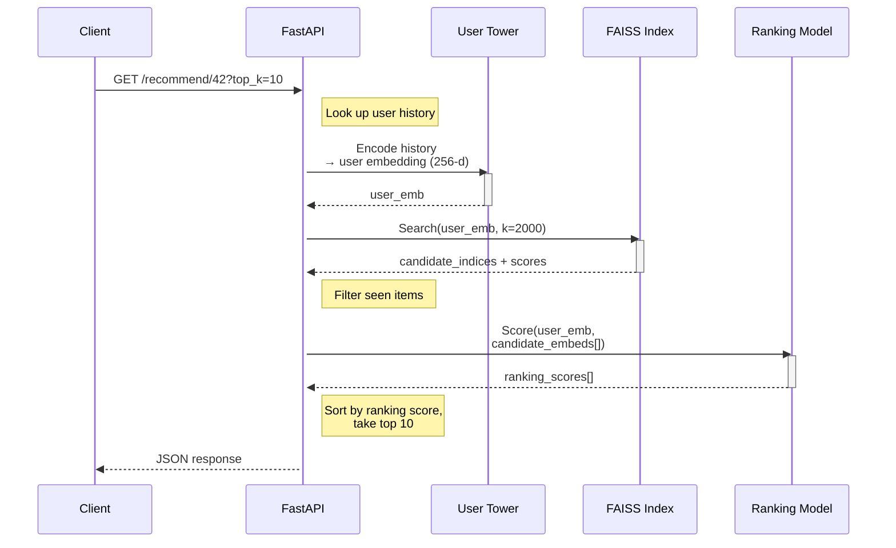

# API Reference

> **Movie Recommendation API** — Two-Stage Recommendation System: Retrieval (Two-Tower) + Neural Ranking  
> Version `1.0.0` · Served via FastAPI + Uvicorn

---

## Base URL

```
http://localhost:8000
```

---

## Startup Behavior

On startup, the API loads all required models and data into memory via the **lifespan** context manager:

| Component | Source |
|---|---|
| Retrieval Model (Two-Tower) | `checkpoints/retrieval_v5_256_dims_lr_wd_50_epochs/best_retrieval_model.pth` |
| Ranking Model (MLP) | `checkpoints/ranker_v2_more_dims/best_ranking_model.pth` |
| FAISS Index | `data/artifacts/faiss_index.bin` |
| Item Embeddings | `data/artifacts/faiss_item_embeddings.npy` |
| FAISS Metadata | `data/artifacts/faiss_metadata.pkl` |
| User History Map | Built from `train.parquet`, `val.parquet`, `test.parquet` |
| Item Title Map | Built from `data/processed/items.csv` |

Startup time depends on hardware; expect **1–3 minutes** for loading models and building the user history map.

---

## Endpoints

### `GET /health`

Health check endpoint. Returns the status of all loaded components.

**Request:**
```bash
curl http://localhost:8000/health
```

**Response:**
```json
{
  "status": "healthy",
  "models_loaded": {
    "retrieval": true,
    "ranking": true,
    "faiss": true
  },
  "catalog_size": 434364,
  "num_users": 102873
}
```

**Response Fields:**

| Field | Type | Description |
|---|---|---|
| `status` | `string` | Always `"healthy"` if the endpoint is reachable |
| `models_loaded.retrieval` | `bool` | Whether the Two-Tower retrieval model is loaded |
| `models_loaded.ranking` | `bool` | Whether the ranking MLP is loaded |
| `models_loaded.faiss` | `bool` | Whether the FAISS index is loaded |
| `catalog_size` | `int` | Number of items in the FAISS index |
| `num_users` | `int` | Number of users with history data |

---

### `GET /recommend/{user_id}`

Generate personalized movie recommendations for a user. This endpoint executes the **full two-stage pipeline**:

1. **Encode** the user's history through the retrieval model's user tower → 256-d user embedding
2. **Retrieve** top-K candidates via FAISS approximate nearest neighbor search
3. **Rank** candidates using the neural ranking model
4. **Return** the top-N results sorted by ranking score

**Path Parameters:**

| Parameter | Type | Required | Description |
|---|---|---|---|
| `user_id` | `int` | ✅ | The integer user ID |

**Query Parameters:**

| Parameter | Type | Default | Description |
|---|---|---|---|
| `top_k` | `int` | `20` | Number of recommendations to return |
| `exclude_seen` | `bool` | `true` | Whether to exclude previously watched items |

**Request:**
```bash
# Basic — default 20 recommendations
curl http://localhost:8000/recommend/42

# Custom — 10 recommendations, include previously seen items
curl "http://localhost:8000/recommend/42?top_k=10&exclude_seen=false"
```

**Response:**
```json
{
  "user_id": 42,
  "recommendations": [
    {
      "rank": 1,
      "title": "The Dark Knight",
      "item_id": "B001GZ6QEC",
      "global_idx": 15423,
      "ranking_score": 0.9847,
      "retrieval_score": 0.8932
    },
    {
      "rank": 2,
      "title": "Inception",
      "item_id": "B003Y5H5BA",
      "global_idx": 28741,
      "ranking_score": 0.9712,
      "retrieval_score": 0.8801
    }
  ],
  "inference_time_ms": 45.23,
  "retrieval_candidates": 2000,
  "history_length": 37
}
```

**Response Fields:**

| Field | Type | Description |
|---|---|---|
| `user_id` | `int` | The queried user ID |
| `recommendations` | `array` | Ordered list of recommended items |
| `recommendations[].rank` | `int` | 1-indexed position in the final sorted list |
| `recommendations[].title` | `string` | Movie/TV show title |
| `recommendations[].item_id` | `string` | Amazon parent ASIN |
| `recommendations[].global_idx` | `int` | Internal global index (for debugging) |
| `recommendations[].ranking_score` | `float` | Sigmoid output of the ranking model (0–1) |
| `recommendations[].retrieval_score` | `float` | FAISS inner-product similarity score |
| `inference_time_ms` | `float` | End-to-end inference latency in milliseconds |
| `retrieval_candidates` | `int` | Number of candidates retrieved from FAISS |
| `history_length` | `int` | Number of items in the user's watch history |

**Error Responses:**

| Status | Condition | Body |
|---|---|---|
| `404` | User ID not found in the system | `{"detail": "User 99999 not found"}` |

---

### `GET /user/{user_id}/history`

Retrieve the complete viewing history for a given user.

**Path Parameters:**

| Parameter | Type | Required | Description |
|---|---|---|---|
| `user_id` | `int` | ✅ | The integer user ID |

**Request:**
```bash
curl http://localhost:8000/user/42/history
```

**Response:**
```json
{
  "user_id": 42,
  "num_items": 37,
  "history": [
    {
      "global_idx": 8921,
      "title": "Breaking Bad: Season 1",
      "item_id": "B001JDRCZM"
    },
    {
      "global_idx": 12034,
      "title": "The Shawshank Redemption",
      "item_id": "B000P0J0AQ"
    }
  ]
}
```

**Response Fields:**

| Field | Type | Description |
|---|---|---|
| `user_id` | `int` | The queried user ID |
| `num_items` | `int` | Total number of items in the user's history |
| `history` | `array` | Ordered list of items the user has interacted with |
| `history[].global_idx` | `int` | Internal global index |
| `history[].title` | `string` | Movie/TV show title |
| `history[].item_id` | `string` | Amazon parent ASIN |

**Error Responses:**

| Status | Condition | Body |
|---|---|---|
| `404` | User ID not found | `{"detail": "User 99999 not found"}` |

---

## Inference Pipeline Detail

The `/recommend` endpoint performs the following steps internally:



**Performance characteristics:**
- The FAISS index uses `IndexFlatIP` (exact inner product) for maximum accuracy
- Retrieval searches for up to 2,000 candidates
- The ranking model processes all candidates in a single batch
- Typical end-to-end latency: **30–100ms** (CPU-only)

---

## Configuration

All API configuration is defined in `configs/inference_config.yaml`:

```yaml
retrieval:
  config_path: 'configs/retrieval_config.yaml'
  checkpoint_path: 'checkpoints/retrieval_v5.../best_retrieval_model.pth'

ranking:
  checkpoint_path: 'checkpoints/ranker_v2.../best_ranking_model.pth'
  embed_dim: 256
  hidden_dims: [512, 512, 256]
  dropout_p: 0.2

faiss:
  index_path: 'data/artifacts/faiss_index.bin'
  metadata_path: 'data/artifacts/faiss_metadata.pkl'
  item_embeds_path: 'data/artifacts/faiss_item_embeddings.npy'
  num_candidates: 2000

data:
  train_path: 'data/processed/train.parquet'
  val_path: 'data/processed/val.parquet'
  test_path: 'data/processed/test.parquet'
  items_path: 'data/processed/items.csv'

server:
  host: '0.0.0.0'
  port: 8000
```

---

## Running the API

### Locally

```bash
# From the project root
uvicorn api.inference_api:app --host 0.0.0.0 --port 8000
```

### With Docker

```bash
# Build
docker build -t recsys-api .

# Run
docker run -p 8000:8000 recsys-api
```

### Interactive Docs

FastAPI auto-generates interactive API documentation:

- **Swagger UI:** [http://localhost:8000/docs](http://localhost:8000/docs)
- **ReDoc:** [http://localhost:8000/redoc](http://localhost:8000/redoc)
